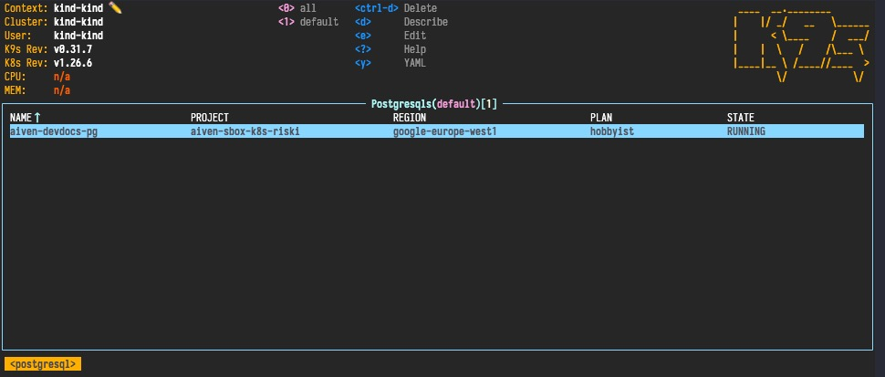

## Get Started

To get started, make sure you have a working [Go environment](https://golang.org/doc/install) and clone the repository:

```shell
git clone git@github.com:aiven/aiven-operator.git
cd aiven-operator
```

### Prerequisites

Before proceeding, please ensure that you have the following dependencies installed:

- [Docker](https://docs.docker.com/) or [Podman](https://podman.io/)
- [Helm](https://helm.sh/)
- [Aiven CLI](https://aiven.io/docs/tools/cli) (make sure you are logged in)
- [jq](https://jqlang.github.io/jq/)
- [kcat](https://github.com/edenhill/kcat)
- base64 (Note: The macOS version does not support the `-w0` flag, which may cause some tests to not work properly)
- [kind](https://kind.sigs.k8s.io/)
- [trunk.io](https://docs.trunk.io/)

Create an Aiven authentication token and an Aiven project, you'll need them in the following sections:

- `AIVEN_TOKEN` — your [authentication token](https://aiven.io/docs/platform/howto/create_authentication_token)
- `AIVEN_PROJECT_NAME` — the name of you [Aiven project](https://aiven.io/docs/platform/howto/manage-project) to run the services in

Optional dependencies:

- [k9s](https://k9scli.io/) — a terminal based UI to interact with our kubernetes clusters

## Building

The project uses the `make` build system. To see the available targets, run `make help`.

Building the operator binary:

```shell
make build
```

## Running

To run the operator locally, first create a local k8s cluster with `kind`:

```{ .sh .no-copy }
$ kind create cluster --image kindest/node:v1.26.6 --wait 5m
Creating cluster "kind" ...
 ✓ Ensuring node image (kindest/node:v1.26.6) 🖼
 ✓ Preparing nodes 📦
 ✓ Writing configuration 📜
 ✓ Starting control-plane 🕹️
 ✓ Installing CNI 🔌
 ✓ Installing StorageClass 💾
 ✓ Waiting ≤ 5m0s for control-plane = Ready ⏳
 • Ready after 14s 💚
Set kubectl context to "kind-kind"
You can now use your cluster with:

kubectl cluster-info --context kind-kinds
```

This creates a k8s cluster and points your `kubectl` to that cluster:

```{ .sh .no-copy }
$ kubectl cluster-info --context kind-kind
Kubernetes control plane is running at https://127.0.0.1:58083
CoreDNS is running at https://127.0.0.1:58083/api/v1/namespaces/kube-system/services/kube-dns:dns/proxy
```

Run the operator:

```shell
ENABLE_WEBHOOKS=false make run
```

In another terminal window, create a Kubernetes [Secret](https://kubernetes.io/docs/concepts/configuration/secret/)
named `aiven-token` (use the Aiven authentication token created earlier):

```{ .sh .no-copy }
export AIVEN_TOKEN=...
kubectl create secret generic aiven-token --from-literal=token=$AIVEN_TOKEN
```

Then, create a manifest for an Aiven PostgreSQL service:

```yaml title="aiven-pg.yaml"
--8<-- "pg-example.yaml"
```

...and create the service at Aiven by applying the manifest:

```shell
kubectl apply -f aiven-pg.yaml
```

You should see the service be created on Aiven's side using either [Aiven Console](https://console.aiven.io/) or Aiven CLI:

```{ .sh .no-copy }
$ avn project switch PROJECT_NAME
$ avn service list
SERVICE_NAME      SERVICE_TYPE  STATE       CLOUD_NAME           PLAN      CREATE_TIME           UPDATE_TIME           NOTIFICATIONS
================  ============  ==========  ===================  ========  ====================  ====================  =============
aiven-devdocs-pg  pg            REBUILDING  google-europe-west1  hobbyist  2024-01-01T00:00:00Z  2024-01-01T00:01:00Z
```

To see the resource on k8s side, use `kubectl`:

```{ .sh .no-copy }
$ kubectl get postgresqls
NAME               PROJECT                REGION                PLAN       STATE
aiven-devdocs-pg   aiven-sbox-k8s-riski   google-europe-west1   hobbyist   REBUILDING
```

... or by running `k9s` in another terminal window and type ": postgresqls" to see the provisioned
PostgreSQL resources:



## Testing

For this section you'll need to set `export AIVEN_TOKEN=...` and an `export AIVEN_PROJECT_NAME=...` as well as `export ENABLE_WEBHOOKS=false` (see [Prerequisites](./developer-guide.md#prerequisites)).

!!! note

    If you encounter any issues with webhooks, you have the option to disable them by running `export ENABLE_WEBOOKS=false`

### Unit

Running all unit tests is possible by running `make test`. To run a targeted test, use `run=TestGrafana make test`.

### e2e

Setup the test environment:

```shell
make e2e-setup-kind
```

The e2e tests are configured to run against a project called `aiven-ci-kubernetes-operator`. To run the test against

```shell
make test-e2e-preinstalled
```

To remove the kind cluster, simply execute the following command:

```shell
kind delete cluster
```

## Resource generation

Please see [this page](resource-generation.md) for more information.

## Documentation

The documentation is written in markdown and generated by [mkdocs](https://www.mkdocs.org/)
and [mkdocs-material](https://squidfunk.github.io/mkdocs-material/).

To run the documentation live preview:

```shell
make serve-docs
```

And open the `http://localhost:8000/aiven-operator/` page in your web browser.

The documentation API Reference section is generated automatically from
the source code during the documentation deployment. To generate it locally, run the following command:

```shell
make docs
```
