# Resource generation

Aiven Kubernetes Operator generates service configs code (also known as _user configs_)
and documentation
from public [service types schema][service-types].

## Flow overview

When a new schema is issued on the API,
a cron job fetches it, parses, patches, and saves in a shared library — [go-api-schemas][go-api-schemas].

When the library is updated, 
the GitHub [dependabot](https://github.com/dependabot) creates PRs to the dependant repositories, 
like Aiven Kubernetes Operator and Aiven Terraform Provider.

Then the [`make generate`](#make-generate) command is called by GitHub action.
And the PR is ready for review.

```mermaid
flowchart TB
    API(Aiven API) <-.->|polls schema updates| Schema([go-api-schemas])
    Bot(dependabot) <-.->|polls updates| Schema 
    Bot-->|pull request|UpdateOP[/"✨ $ make generate ✨"/]
    UpdateOP-->|review| OP([operator repository])
```



## make generate

The command runs several generators in a certain sequence.
First, the user config generator is called.
Then [controller-gen][controller-gen] cli.
Then [API reference][api-reference] docs generator.  
Here how it goes in the details:

1. User config generator creates Go structs (k8s api compatible objects) with docstrings, 
   validation rules and constraints (immutable, maxLength, etc)
2. [controller-gen][controller-gen] generates k8s methods,
   generates [CRDs][crd] for those objects, 
   creates charts for cluster roles and webhooks. 
3. Docs generator creates [API reference][api-reference] out of CRDs:
    1. it looks for an example file for the given CRD kind in `./<api-reference-docs>/example/`,
       if it finds one, it validates that with the CRD. 
       Each CRD has an OpenAPI v3 schema as a part of it. 
       This is also used by Kubernetes itself to validate user input.
    2. generates full spec reference out of the schema
    3. creates a markdown file with spec and example (if exists)
4. Charts generator 
   updates CRDs, webhooks and cluster roles charts

[go-api-schemas]: https://github.com/aiven/go-api-schemas
[service-types]: https://api.aiven.io/doc/#tag/Service/operation/ListPublicServiceTypes
[api-reference]: ../api-reference/index.md
[controller-gen]: https://book.kubebuilder.io/reference/controller-gen.html
[crd]: https://kubernetes.io/docs/concepts/extend-kubernetes/api-extension/custom-resources/

```mermaid
flowchart TB
    Make[/$ make generate/]-->Generator(userconfig generator<br> creates/updates structs using updated spec)
    Generator-->|go: KafkaUserConfig struct| K8S(controller-gen<br> adds k8s methods to structs)
    K8S-->|go files| CRD(controller-gen<br> creates CRDs out of structs)
    CRD-->|CRD: aiven.io_kafkas.yaml| Docs(docs generator)
    subgraph API reference generation
        Docs-->|aiven.io_kafkas.yaml|Reference(creates reference<br> out of CRD)
        Docs-->|examples/kafka.yaml,<br> aiven.io_kafkas.yaml|Examples(validates example<br> using CRD)
        Examples--> Markdown(creates docs out of CRDs, adds examples)
        Reference-->Markdown(kafka.md)
    end
    CRD-->|yaml files|Charts(charts generator<br> updates helm charts)
    Charts-->ToRelease("Ready to release 🎉")
    Markdown-->ToRelease
```



## Charts version bump

By default,
charts generator keeps the current helm chart's version,
because it doesn't know [semver](https://semver.org/).
You need it to do manually.

To do so run the following command with the version of your choice:

```shell
make version=v1.0.0 charts
```
