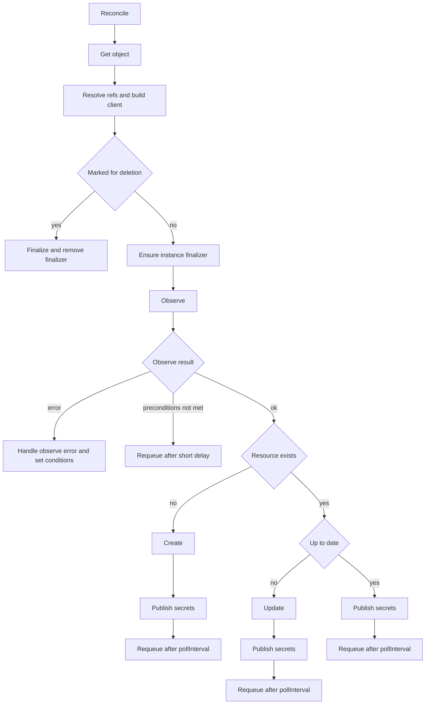

# Generic reconciler

Generic `Reconciler[T]` drives most controllers, including `ClickhouseUser`. It wraps common concerns around Aiven resources, status conditions, connection Secrets, events, and requeue logic.

## Overview

The reconciler lives in `controllers/reconciler.go` and works with resources that implement `v1alpha1.AivenManagedObject`. It is configured with:
- `T` - the concrete CR type, for example `*v1alpha1.ClickhouseUser`
- `newAivenGeneratedClient` - factory for the Aiven API client
- `newController` - implementation of `AivenController[T]` with `Observe`, `Create`, `Update`, `Delete`
- `newObj` - constructor for new instances of `T`
- `newSecret` - helper that builds a connection Secret from `SecretDetails`

On each reconcile it:
- resolves tokens and Kubernetes references
- ensures finalizers and deletion policy are respected
- calls the controller to `Observe`, then `Create` or `Update` if needed
- publishes connection details to Secrets when provided
- sets status conditions and emits Kubernetes events
- requeues in steady state using a fixed poll interval

## Observe

`Observe` is the first controller callback in the loop. It:
- checks preconditions, for example that the Aiven service exists and is usable
- discovers whether the remote resource exists
- updates status fields that can be derived without mutating Aiven, such as UUIDs
- prepares connection details (`SecretDetails`) to publish when the resource exists

It returns an `Observation` with:
- `ResourceExists` - whether the remote resource currently exists
- `ResourceUpToDate` - whether the remote state is already in sync with the spec
- `SecretDetails` - optional map of connection keys to publish

When `Observe` returns an error:
- powered-off services and other precondition failures surface as `Preconditions` errors, an `Error` condition, and events
- retryable Aiven API errors (for example, 404/5xx) trigger a soft requeue without a hard error
- any other error is treated as a hard error and recorded in an `Error` condition

## Create and Update

When `ResourceExists` is `false`, the reconciler calls `Create`. When it's `true` but `ResourceUpToDate` is `false`, it calls `Update`.

`Create` creates the remote Aiven resource, updates status fields that are known immediately (for example, UUID), and returns a `CreateResult` with `SecretDetails` to publish.

`Update` reconciles differences between spec and remote state on Aiven, keeps status conditions up to date (for example, marks the resource as running), and returns an `UpdateResult` with `SecretDetails` to publish.

On success the reconciler publishes the returned `SecretDetails`, marks the current generation as processed, and schedules the next reconcile after a fixed poll interval.

On failure it sets an `Error` condition with the appropriate reason and emits events such as `UnableToCreateOrUpdateAtAiven` or `UnableToWaitForInstanceToBeRunning`.

## Secret publishing

Connection details are published via `publishSecretDetails`:
- If `SecretDetails` is empty, no action is taken.
- If `NoSecret()` on the resource is `true`, the reconciler emits a `ConnInfoSecretCreationDisabled` event and doesn't touch any Secret.
- If the resource doesn't implement `objWithSecret`, secret publishing is skipped.
- Otherwise the reconciler builds the desired Secret using `newSecret(obj, details, addPrefix)`, uses `controllerutil.CreateOrUpdate` to create or update it, applies labels and annotations from `connInfoSecretTarget`, and sets the Secret to be owned by the resource via `SetControllerReference`.

If secret sync fails (for example, the Secret is owned by another controller or the API call fails), the reconciler:
- emits a `Warning` event with reason `CannotPublishConnectionDetails`;
- sets an `Error` condition with reason `ConnInfoSecret`;
- returns a hard error to the caller.

This makes secret ownership and sync problems visible in both events and conditions.

## Finalization and deletion policy

When a resource is marked for deletion, the reconciler enters the `finalize` path:
- If the resource doesn't have the `instanceDeletionFinalizer`, no action is taken.
- If it has the finalizer, the reconciler checks the `controllers.aiven.io/deletion-policy` annotation. If it's absent, the reconciler calls `Delete` on the controller to remove the remote resource. If it's set to `Orphan`, the reconciler skips deletion on Aiven and only removes the finalizer. Any other value is treated as an error and surfaces via an `Error` condition with reason `Delete`.
- Deletion errors are handled carefully: dependency errors (`ErrDeleteDependencies`) cause a soft requeue, transient server errors trigger a requeue for another attempt, and not-found errors and generic failures are recorded as events and conditions.

Once finalization succeeds, the reconciler removes the finalizer so that Kubernetes can delete the resource.
