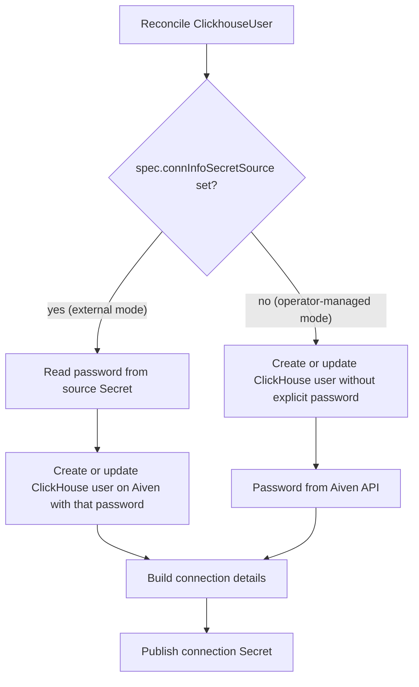

# ClickhouseUser

ClickhouseUser controller manages ClickHouse users on Aiven and publishes connection Secrets, based on the schema described in `resources/clickhouseuser.md`.

## Password management modes

The controller supports two ways to manage ClickHouse user passwords, driven by `spec.connInfoSecretSource`.

### External mode (`connInfoSecretSource` set)

In external mode, the password comes from a Kubernetes Secret and is treated as the source of truth.

The controller reads the password from `spec.connInfoSecretSource`:
- `name` - name of the source Secret
- `passwordKey` - key in `data` with the password
- `namespace` - optional; defaults to the ClickhouseUser namespace

On create the password from the source Secret is sent to Aiven when creating the ClickHouse user, and the same password is written into the connection Secret configured by `spec.connInfoSecretTarget`. If the create call doesn't return a password (the field is optional in the API), the controller issues a password reset with the password from the source Secret and uses the returned value when publishing the connection Secret.

On update the password from the source Secret is always enforced via a password reset call to Aiven, and the connection Secret is refreshed to match.

If the source Secret is missing, the key is missing, or the password length is invalid (must be 8-256 characters), reconciliation fails with a configuration error and the remote ClickHouse user is left unchanged until the configuration is fixed.

Because the controller watches `connInfoSecretSource`, updating the password in the source Secret automatically triggers reconciliation and rotates the ClickHouse user password to the new value.

### Operator-managed mode (no `connInfoSecretSource`)

In operator-managed mode, the password is managed by Aiven and the connection Secret is treated as output only.

On create the controller creates the ClickHouse user without an explicit password, then captures the password from the Aiven API (either directly from the create response or by making a one-time password reset) and writes it into the connection Secret.

On later reconciles the controller keeps publishing connection details (host, port, username) to the connection Secret but never uses the connection Secret as input when deciding which password to use. The source of truth for the password remains Aiven. If the API doesn't return a password on observe, the controller leaves password keys in the Secret untouched and doesn't attempt to rotate the password.

You switch between modes by setting or clearing `connInfoSecretSource` on the ClickhouseUser resource.

## Connection Secret semantics

The connection Secret configured by `spec.connInfoSecretTarget` is treated as output only. Its contents are always derived from either:
- the external password source (external mode), or
- the Aiven API (operator-managed mode).

Editing the connection Secret directly doesn't change the ClickHouse user password. Use `connInfoSecretSource` or the Aiven Console/API to manage passwords.

### Secret keys

For each ClickhouseUser, the controller publishes:
- Prefixed keys (recommended for new workloads):
  - `CLICKHOUSEUSER_HOST`
  - `CLICKHOUSEUSER_PORT`
  - `CLICKHOUSEUSER_USERNAME`
  - `CLICKHOUSEUSER_PASSWORD` (when the password is known)
- Legacy, unprefixed keys (for compatibility with existing workloads):
  - `HOST`
  - `PORT`
  - `USERNAME`
  - `PASSWORD` (when the password is known)

The prefix can be customized via `spec.connInfoSecretTarget.prefix`. When set, it's used instead of `CLICKHOUSEUSER_` for the prefixed keys; unprefixed keys remain the same.

### Secret ownership and errors

The controller creates or updates the connection Secret using Kubernetes controller references:
- If the Secret doesn't exist, it's created and owned by the ClickhouseUser.
- If it exists and is already owned by the same ClickhouseUser, it's updated in place.
- If it's owned by a different controller or resource, the controller:
  - emits a `Warning` event with reason `CannotPublishConnectionDetails`;
  - sets an `Error` condition with reason `ConnInfoSecret` on the ClickhouseUser;
  - leaves the remote ClickHouse user unchanged.

This makes ownership conflicts visible without silently adopting existing Secrets.

## Built-in users

Built-in ClickHouse users (such as `avnadmin`) cannot be deleted from Aiven, but their passwords can still be managed via `connInfoSecretSource`.

When you create a ClickhouseUser with `metadata.name: avnadmin` and a configured `connInfoSecretSource`, the controller applies the password from the source Secret to the existing built-in user and writes it to the connection Secret.

When the ClickhouseUser resource is deleted, the Kubernetes ClickhouseUser is removed and the controller intentionally skips deleting the built-in user on the Aiven side.

## Flow diagram

The following diagram summarizes how a ClickhouseUser resource is reconciled with respect to password handling and connection Secret publishing:

