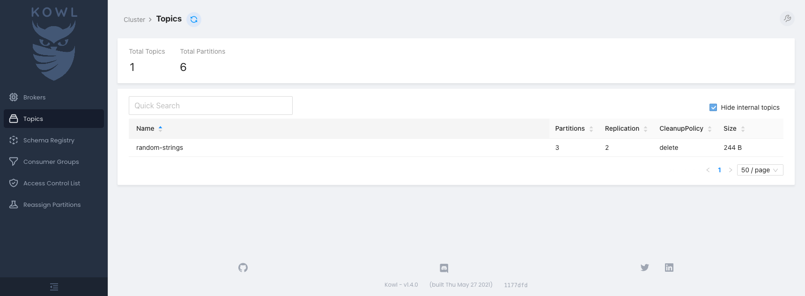

Aiven for Apache Kafka is an excellent option if you need to run Apache Kafka at scale. With Aiven Kubernetes Operator
you can get up and running with a suitably sized Apache Kafka service in a few minutes.

!!! note
    Before going through this guide, make sure you have a [Kubernetes cluster](../../installation/prerequisites/) with the [operator installed](../../installation/) 
    and a [Kubernetes Secret with an Aiven authentication token](../../authentication/).

## Creating a Kafka instance

1\. Create a file named `kafka-sample.yaml`, and add the following content:

```yaml
apiVersion: aiven.io/v1alpha1
kind: Kafka
metadata:
  name: kafka-sample
spec:
  # gets the authentication token from the `aiven-token` Secret
  authSecretRef:
    name: aiven-token
    key: token

  # outputs the Kafka connection on the `kafka-connection` Secret
  connInfoSecretTarget:
    name: kafka-auth

  # add your Project name here
  project: <your-project-name>

  # cloud provider and plan of your choice
  # you can check all of the possibilities here https://aiven.io/pricing
  cloudName: google-europe-west1
  plan: startup-2

  # general Aiven configuration
  maintenanceWindowDow: friday
  maintenanceWindowTime: 23:00:00

  # specific Kafka configuration
  userConfig:
    kafka_version: '2.7'
```

2\. Create the following resource on Kubernetes:

```shell
kubectl apply -f kafka-sample.yaml 
```

3\. Inspect the service created using the command below. 

```shell
kubectl get kafka.aiven.io kafka-sample
```

The output has the project name and state, similar to the following:

```{ .shell .no-copy }

NAME           PROJECT          REGION                PLAN        STATE
kafka-sample   <your-project>   google-europe-west1   startup-2   RUNNING
```

 After a couple of minutes, the `STATE` field is changed to `RUNNING`, and is ready to be used.

## Using the connection Secret

For your convenience, the operator automatically stores the Kafka connection information in a Secret created with the
name specified on the `connInfoSecretTarget` field.

```shell
kubectl describe secret kafka-auth 
```

The output is similar to the following:

```{ .shell .no-copy }
Name:         kafka-auth
Namespace:    default
Annotations:  <none>

Type:  Opaque

Data
====
CA_CERT:      1537 bytes
HOST:         41 bytes
PASSWORD:     16 bytes
PORT:         5 bytes
USERNAME:     8 bytes
ACCESS_CERT:  1533 bytes
ACCESS_KEY:   2484 bytes
```

You can use the [jq](https://github.com/stedolan/jq) to quickly decode the Secret:

```shell
kubectl get secret kafka-auth -o json | jq '.data | map_values(@base64d)'
```

The output is similar to the following:

```{ .json .no-copy }
{
  "CA_CERT": "<secret-ca-cert>",
  "ACCESS_CERT": "<secret-cert>",
  "ACCESS_KEY": "<secret-access-key>",
  "HOST": "kafka-sample-your-project.aivencloud.com",
  "PASSWORD": "<secret-password>",
  "PORT": "13041",
  "USERNAME": "avnadmin"
}
```

## Testing the connection

You can verify your access to the Kafka cluster from a Pod using the authentication data from the `kafka-auth` Secret. [kcat](https://github.com/edenhill/kcat) is used for our examples below.

1\. Create a file named `kafka-test-connection.yaml`, and add the following content:

```yaml
apiVersion: v1
kind: Pod
metadata:
  name: kafka-test-connection
spec:
  restartPolicy: Never
  containers:
    - image: edenhill/kcat:1.7.0
      name: kcat

      # the command below will connect to the Kafka cluster
      # and output its metadata
      command: [
          'kcat', '-b', '$(HOST):$(PORT)',
          '-X', 'security.protocol=SSL',
          '-X', 'ssl.key.location=/kafka-auth/ACCESS_KEY',
          '-X', 'ssl.key.password=$(PASSWORD)',
          '-X', 'ssl.certificate.location=/kafka-auth/ACCESS_CERT',
          '-X', 'ssl.ca.location=/kafka-auth/CA_CERT',
          '-L'
      ]

      # loading the data from the Secret as environment variables
      # useful to access the Kafka information, like hostname and port
      envFrom:
        - secretRef:
            name: kafka-auth

      volumeMounts:
        - name: kafka-auth
          mountPath: "/kafka-auth"

  # loading the data from the Secret as files in a volume
  # useful to access the Kafka certificates 
  volumes:
    - name: kafka-auth
      secret:
        secretName: kafka-auth
```

2\. Apply the file.

```shell
kubectl apply -f kafka-test-connection.yaml
```

Once successfully applied, you have a log with the metadata information about the Kafka cluster.

```shell
kubectl logs kafka-test-connection 
```

The output is similar to the following:

```{ .shell .no-copy }
Metadata for all topics (from broker -1: ssl://kafka-sample-your-project.aivencloud.com:13041/bootstrap):
 3 brokers:
  broker 2 at 35.205.234.70:13041
  broker 3 at 34.77.127.70:13041 (controller)
  broker 1 at 34.78.146.156:13041
 0 topics:
```

## Creating a `KafkaTopic` and `KafkaACL`
To properly produce and consume content on Kafka, you need topics and ACLs. The operator supports both with
the `KafkaTopic` and `KafkaACL` resources.

Below, here is how to create a Kafka topic named `random-strings` where random string messages will be sent.

1\. Create a file named `kafka-topic-random-strings.yaml` with the content below:

```yaml
apiVersion: aiven.io/v1alpha1
kind: KafkaTopic
metadata:
  name: random-strings
spec:
  authSecretRef:
    name: aiven-token
    key: token

  project: <your-project-name>
  serviceName: kafka-sample

  # here we can specify how many partitions the topic should have
  partitions: 3
  # and the topic replication factor
  replication: 2

  # we also support various topic-specific configurations
  config:
    flush_ms: 100
```

2\. Create the resource on Kubernetes:

```shell
kubectl apply -f kafka-topic-random-strings.yaml
```

3\. Create a user and an ACL. To use the Kafka topic, create a new user with the `ServiceUser` resource (in order to
   avoid using the `avnadmin` superuser), and the `KafkaACL` to allow the user access to the topic.

In a file named `kafka-acl-user-crab.yaml`, add the following two resources:

```yaml
apiVersion: aiven.io/v1alpha1
kind: ServiceUser
metadata:
  # the name of our user 🦀
  name: crab
spec:
  authSecretRef:
    name: aiven-token
    key: token

  # the Secret name we will store the users' connection information
  # looks exactly the same as the Secret generated when creating the Kafka cluster
  # we will use this Secret to produce and consume events later!
  connInfoSecretTarget:
    name: kafka-crab-connection

  # the Aiven project the user is related to
  project: <your-project-name>

  # the name of our Kafka Service
  serviceName: kafka-sample

---

apiVersion: aiven.io/v1alpha1
kind: KafkaACL
metadata:
  name: crab
spec:
  authSecretRef:
    name: aiven-token
    key: token

  project: <your-project-name>
  serviceName: kafka-sample

  # the username from the ServiceUser above
  username: crab

  # the ACL allows to produce and consume on the topic
  permission: readwrite

  # specify the topic we created before
  topic: random-strings
```

To create the `crab` user and its permissions, execute the following command:

```shell
kubectl apply -f kafka-acl-user-crab.yaml
```

## Producing and consuming events

Using the previously created `KafkaTopic`, `ServiceUser`, `KafkaACL`, you can produce and consume events.

You can use [kcat](https://github.com/edenhill/kcat) to produce a message into Kafka, and the `-t random-strings` argument to select the desired topic,
and use the content of the `/etc/issue` file as the message's body.

1\. Create a `kafka-crab-produce.yaml` file with the content below:

```yaml
apiVersion: v1
kind: Pod
metadata:
  name: kafka-crab-produce
spec:
  restartPolicy: Never
  containers:
    - image: edenhill/kcat:1.7.0
      name: kcat

      # the command below will produce a message with the /etc/issue file content
      command: [
          'kcat', '-b', '$(HOST):$(PORT)',
          '-X', 'security.protocol=SSL',
          '-X', 'ssl.key.location=/crab-auth/ACCESS_KEY',
          '-X', 'ssl.key.password=$(PASSWORD)',
          '-X', 'ssl.certificate.location=/crab-auth/ACCESS_CERT',
          '-X', 'ssl.ca.location=/crab-auth/CA_CERT',
          '-P', '-t', 'random-strings', '/etc/issue',
      ]

      # loading the crab user data from the Secret as environment variables
      # useful to access the Kafka information, like hostname and port
      envFrom:
        - secretRef:
            name: kafka-crab-connection

      volumeMounts:
        - name: crab-auth
          mountPath: "/crab-auth"

  # loading the crab user information from the Secret as files in a volume
  # useful to access the Kafka certificates 
  volumes:
    - name: crab-auth
      secret:
        secretName: kafka-crab-connection
```

2\. Create the Pod with the following content:

```shell
kubectl apply -f kafka-crab-produce.yaml
```

Now your event is stored in Kafka.

To _consume_ a message, you can use a graphical interface called [Kowl](https://github.com/cloudhut/kowl). It allows you
to explore information about our Kafka cluster, such as brokers, topics, or consumer groups.

1\. Create a Kubernetes Pod and service to deploy and access Kowl. Create a file named `kafka-crab-consume.yaml` with the
   content below:

```yaml
apiVersion: v1
kind: Pod
metadata:
  name: kafka-crab-consume
  labels:
    app: kafka-crab-consume
spec:
  containers:
    - image: quay.io/cloudhut/kowl:v1.4.0
      name: kowl

      # kowl configuration values
      env:
        - name: KAFKA_TLS_ENABLED
          value: 'true'

        - name: KAFKA_BROKERS
          value: $(HOST):$(PORT)
        - name: KAFKA_TLS_PASSPHRASE
          value: $(PASSWORD)

        - name: KAFKA_TLS_CAFILEPATH
          value: /crab-auth/CA_CERT
        - name: KAFKA_TLS_CERTFILEPATH
          value: /crab-auth/ACCESS_CERT
        - name: KAFKA_TLS_KEYFILEPATH
          value: /crab-auth/ACCESS_KEY

      # inject all connection information as environment variables
      envFrom:
        - secretRef:
            name: kafka-crab-connection

      volumeMounts:
        - name: crab-auth
          mountPath: /crab-auth

  # loading the crab user information from the Secret as files in a volume
  # useful to access the Kafka certificates 
  volumes:
    - name: crab-auth
      secret:
        secretName: kafka-crab-connection

---

# we will be using a simple service to access Kowl on port 8080
apiVersion: v1
kind: Service
metadata:
  name: kafka-crab-consume
spec:
  selector:
    app: kafka-crab-consume
  ports:
    - port: 8080
      targetPort: 8080
```

2\. Create the resources with:

```shell
kubectl apply -f kafka-crab-consume.yaml
```

3\. In another terminal create a port-forward tunnel to your Pod:

```shell
kubectl port-forward kafka-crab-consume 8080:8080
```

4\. In the browser of your choice, access the [http://localhost:8080]() address. You now see a page with
   the `random-strings` topic listed:
   

5\. Click the topic name to see the message.
   

You have now consumed the message.
